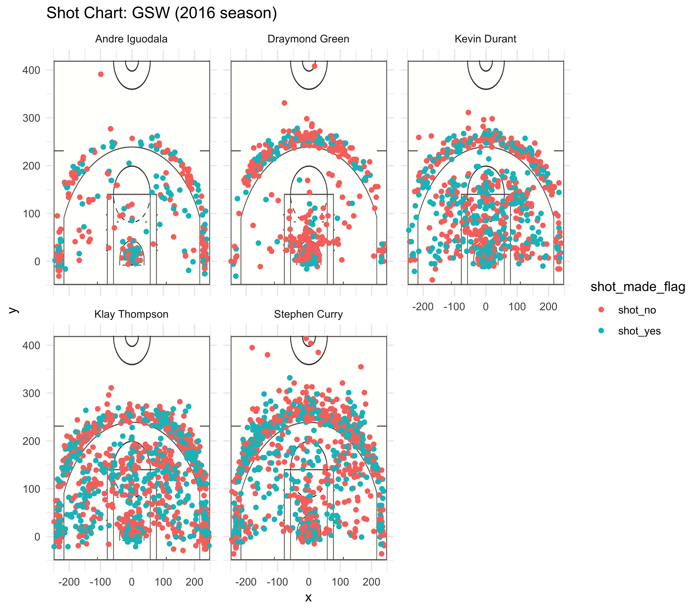

```{r out.width='80%', echo = FALSE, fig.align='center'}
library(dplyr)

dat <- read.csv('../data/shots-data.csv')
```


##2PT Effective Shooting % by Player:
2 PT Field Goal effective shooting percentage by
player, arranged in descending order by percentage.
```{r}
arrange(
  summarise(
    group_by(dat,name),
    total = sum(shot_type == "2PT Field Goal"),
    made = sum(shot_made_flag == "shot_yes" & shot_type == "2PT Field Goal"),
    per_made = sum(shot_made_flag == "shot_yes" & shot_type == "2PT Field Goal")/sum(shot_type == "2PT Field Goal")
),desc(per_made)
)
```

##3PT Effective Shooting % by Player: 
3 PT Field Goal effective shooting percentage by
player, arranged in descending order by percentage.
```{r}
arrange(
  summarise(
    group_by(dat,name),
    total = sum(shot_type == "3PT Field Goal"),
    made = sum(shot_made_flag == "shot_yes" & shot_type == "3PT Field Goal"),
    per_made = sum(shot_made_flag == "shot_yes" & shot_type == "3PT Field Goal")/sum(shot_type == "3PT Field Goal")
),desc(per_made)
)
```

##Effective Shooting % by Player:
Overall (i.e. including 2PT and 3PT Field Goals)
effective shooting percentage by player, arranged in descending order by percentage.
```{r}
arrange(
  summarise(
    group_by(dat,name),
    total = length(shot_type),
    made = sum(shot_made_flag == "shot_yes"),
    per_made = sum(shot_made_flag == "shot_yes")/length(shot_type)
),desc(per_made)
)
```


