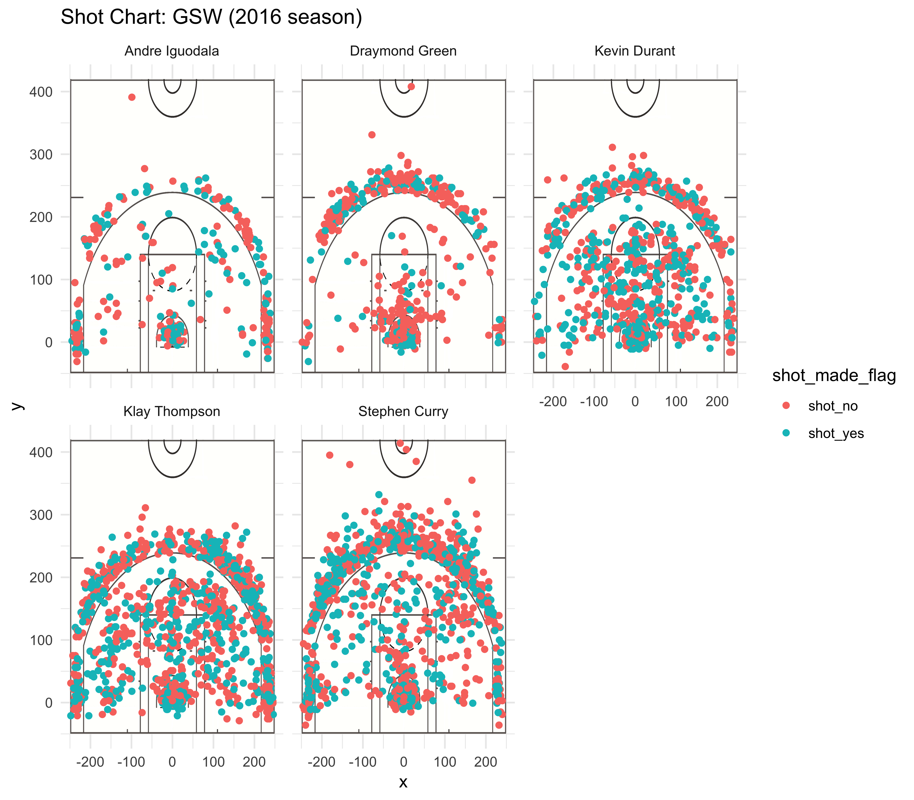

workout01
================
Jue Luo
3/11/2019

    ## Warning: package 'dplyr' was built under R version 3.5.2

    ## 
    ## Attaching package: 'dplyr'

    ## The following objects are masked from 'package:stats':
    ## 
    ##     filter, lag

    ## The following objects are masked from 'package:base':
    ## 
    ##     intersect, setdiff, setequal, union



2PT Effective Shooting % by Player:
-----------------------------------

2 PT Field Goal effective shooting percentage by player, arranged in descending order by percentage.

``` r
arrange(
  summarise(
    group_by(dat,name),
    total = sum(shot_type == "2PT Field Goal"),
    made = sum(shot_made_flag == "shot_yes" & shot_type == "2PT Field Goal"),
    per_made = sum(shot_made_flag == "shot_yes" & shot_type == "2PT Field Goal")/sum(shot_type == "2PT Field Goal")
),desc(per_made)
)
```

    ## # A tibble: 5 x 4
    ##   name           total  made per_made
    ##   <fct>          <int> <int>    <dbl>
    ## 1 Andre Iguodala   210   134    0.638
    ## 2 Kevin Durant     643   390    0.607
    ## 3 Stephen Curry    563   304    0.540
    ## 4 Klay Thompson    640   329    0.514
    ## 5 Draymond Green   346   171    0.494

3PT Effective Shooting % by Player:
-----------------------------------

3 PT Field Goal effective shooting percentage by player, arranged in descending order by percentage.

``` r
arrange(
  summarise(
    group_by(dat,name),
    total = sum(shot_type == "3PT Field Goal"),
    made = sum(shot_made_flag == "shot_yes" & shot_type == "3PT Field Goal"),
    per_made = sum(shot_made_flag == "shot_yes" & shot_type == "3PT Field Goal")/sum(shot_type == "3PT Field Goal")
),desc(per_made)
)
```

    ## # A tibble: 5 x 4
    ##   name           total  made per_made
    ##   <fct>          <int> <int>    <dbl>
    ## 1 Klay Thompson    580   246    0.424
    ## 2 Stephen Curry    687   280    0.408
    ## 3 Kevin Durant     272   105    0.386
    ## 4 Andre Iguodala   161    58    0.360
    ## 5 Draymond Green   232    74    0.319

Effective Shooting % by Player:
-------------------------------

Overall (i.e. including 2PT and 3PT Field Goals) effective shooting percentage by player, arranged in descending order by percentage.

``` r
arrange(
  summarise(
    group_by(dat,name),
    total = length(shot_type),
    made = sum(shot_made_flag == "shot_yes"),
    per_made = sum(shot_made_flag == "shot_yes")/length(shot_type)
),desc(per_made)
)
```

    ## # A tibble: 5 x 4
    ##   name           total  made per_made
    ##   <fct>          <int> <int>    <dbl>
    ## 1 Kevin Durant     915   495    0.541
    ## 2 Andre Iguodala   371   192    0.518
    ## 3 Klay Thompson   1220   575    0.471
    ## 4 Stephen Curry   1250   584    0.467
    ## 5 Draymond Green   578   245    0.424
